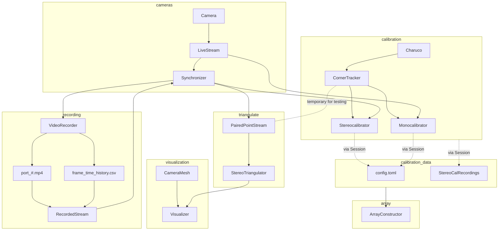

# Current Functionality

To launch the primary functionality of the repo, run `src\gui\main.py`. This will open an ugly dialog to begin a calibration session. Session data is stored in the `sessions` folder in the root directory. The session being launched is coded at the bottom of `main.py`. The general workflow:

1. Print out a charuco board from the Charuco Builder tab
2. Click "Find Additional Cameras" to connect to them
3. Go to the camera tabs and configure resolution/exposure before collecting calibration corners and calibrating.
4. Save calibration parameters on camera tab
5. Once all cameras intrinsic factors are estimated, click the stereocalibration button and calibrate each pair of cameras.
6. Save calibration to `config.toml`.

# Recording

The file `src\recording\video_recorder.py` will launch a VideoRecorder and store the mp4 and frametime data in the session folder. 

# Triangulating

Recorded video can be played back through the synchronizer with synched frames passed to the PairedPointStream which uses the charuco tracker to identify the same point in space between paired frames. Point ID and (X,Y) position for each frame are passed to an `out_q`. The triangulator pulls from this queue, calculates values for ID: (X,Y,Z) and places that calculation on its own `out_q`

# Visualization

The Visualizer constructs camera meshes based on `config.toml` to allow a gut check of the stereocalibration parameters. The camera mesh shape is determined by the actual camera properties and provides another way of assessing reasonableness at a glance. (X,Y,Z) points are read from `triangulator.out_q` and updated to the scene. 

Currently, the origin is the base camera from the stereocalibration pair. Next planned steps include a way to set the origin.

## Current Object Relationships

The general flow of processing is illustrated in the graph below. This does not represent any of the GUI elements which are still a work in progress. My immediate next steps are to stabilize the GUI, making it easier to incorporate the full set of actions that are currently permitted by the back-end of the code base.

