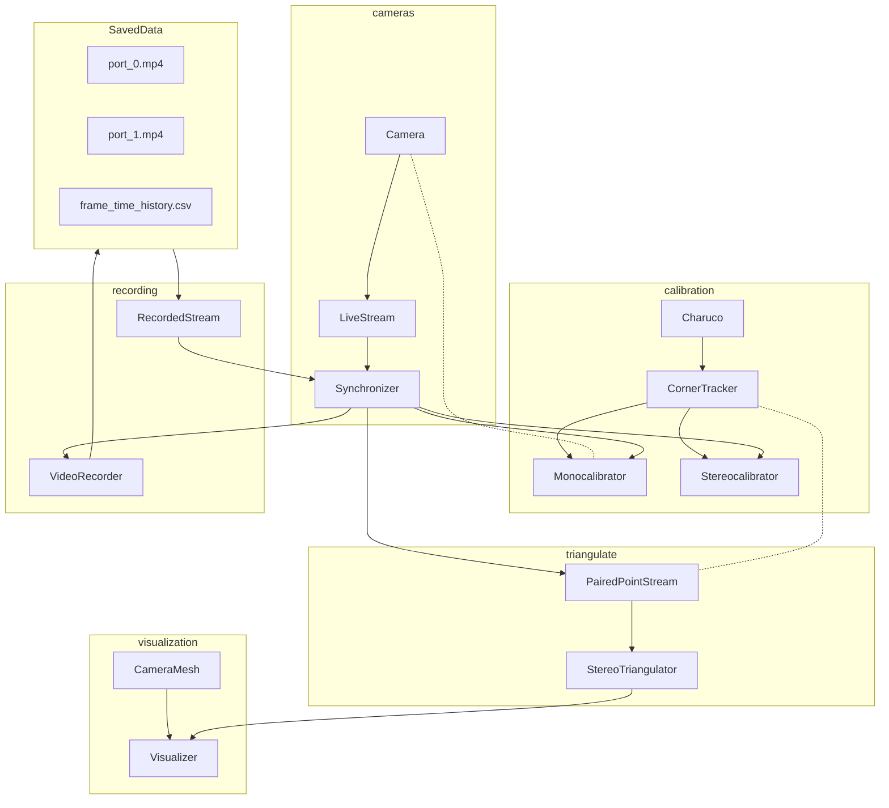

# Current Functionality

To launch the primary functionality of the repo, run `src\gui\main.py`. This will open an ugly dialog to begin a calibration session. The session data is stored in `src\examples\default_session\config.toml`, though this will largely be overwritten when first launched. The over-write can be turned off by commenting out a line of code in the `if __name__ == "__main__"` section of the module (comments point this line of code out).

1. Print out a charuco board from the Charuco Builder tab
2. Click "Find Additional Cameras" to connect to them
3. Go to the camera tabs and configure resolution/exposure before collecting calibration corners and calibrating.
4. Save calibration parameters on camera tab
5. Once all cameras intrinsic factors are estimated, click the stereocalibration button and calibrate each pair of cameras.
6. Save calibration to `config.toml`.

## Under Development

In branch `StereoTriangulateCharuco`, recorded footage of a charuco with a two-camera calibrated system will processed to show corner locations relative to the base camera, and to visualize this within a pyqtgraph 3d display. When this functionality is solidly in place, accuracy metrics can be created. From there, future iterations will be able to compare agreement between stereocamera pairs in a three camera system.

## Things to Uninstall

Going back to Temuge B notebook I instaled plotly and something called nbformat just to visualize the output. 

Don't carry these packages forward as they are not actually necessary for core work.

## Current Object Relationships

I need to see where everything is at the moment. As I go back to address issues with the scale of the charuco board impacting the scale of the calibration output data and how that is reflected in the visualization of the data, I'm realizing I need to take a step back and look at things more broadly.

