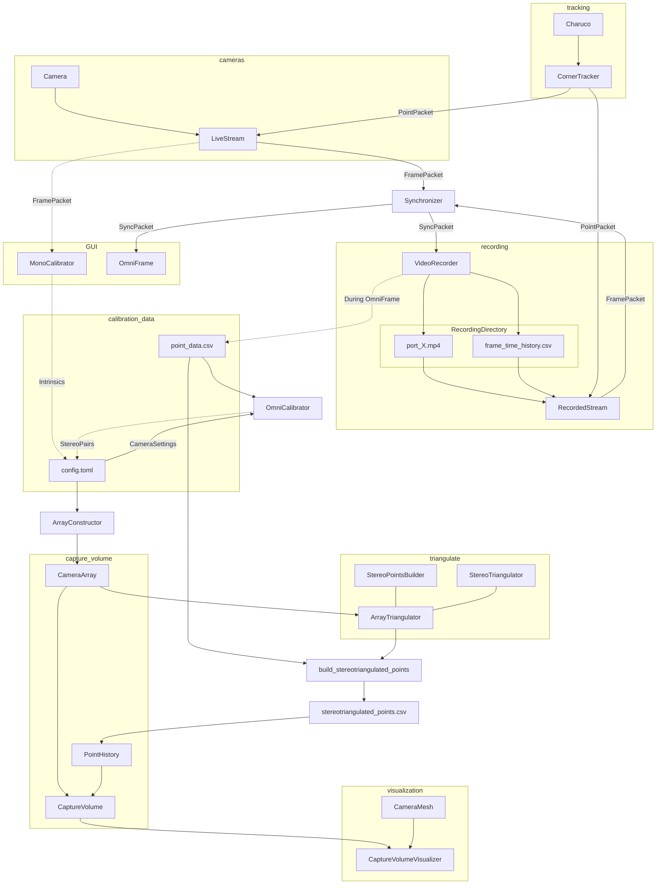

## Current Flow

The general flow of processing is illustrated in the graph below. 

```mermaid
graph TD


LiveStream --FramePacket--> Synchronizer
RecordedStream --FramePacket--> Synchronizer
Synchronizer --SyncPacket--> VideoRecorder

subgraph cameras
    Camera --> LiveStream
end

subgraph tracking
    Charuco --> CornerTracker
    CornerTracker --PointPacket--> LiveStream
end

subgraph GUI
    MonoCalibrator
    OmniFrame
end

Synchronizer --SyncPacket-->  OmniFrame

LiveStream -.FramePacket.-> MonoCalibrator
MonoCalibrator -.Intrinsics.-> config.toml

VideoRecorder --> frame_time_history.csv
VideoRecorder --> port_X.mp4 
VideoRecorder -.During OmniFrame.-> point_data.csv
port_X.mp4 --> RecordedStream
frame_time_history.csv --> RecordedStream


subgraph recording

    RecordedStream
    VideoRecorder 

    subgraph RecordingDirectory
        port_X.mp4
        frame_time_history.csv
    end

end


point_data.csv --> OmniCalibrator
config.toml --CameraSettings--> OmniCalibrator
OmniCalibrator -.StereoPairs.-> config.toml


subgraph calibration_data
    point_data.csv
    config.toml
end

point_data.csv --> build_stereotriangulated_points
ArrayTriangulator --> build_stereotriangulated_points

CornerTracker --PointPacket--> RecordedStream

ArrayConstructor --> CameraArray
config.toml --> ArrayConstructor

CameraArray --> ArrayTriangulator

subgraph triangulate
    ArrayTriangulator
    StereoPointsBuilder --- ArrayTriangulator
    StereoTriangulator --- ArrayTriangulator
end

build_stereotriangulated_points --> stereotriangulated_points.csv
CaptureVolume --> CaptureVolumeVisualizer

stereotriangulated_points.csv --> PointHistory

subgraph capture_volume
CameraArray --> CaptureVolume
PointHistory --> CaptureVolume

CaptureVolume
end


subgraph visualization
    CaptureVolumeVisualizer
    CameraMesh --> CaptureVolumeVisualizer
end

```
