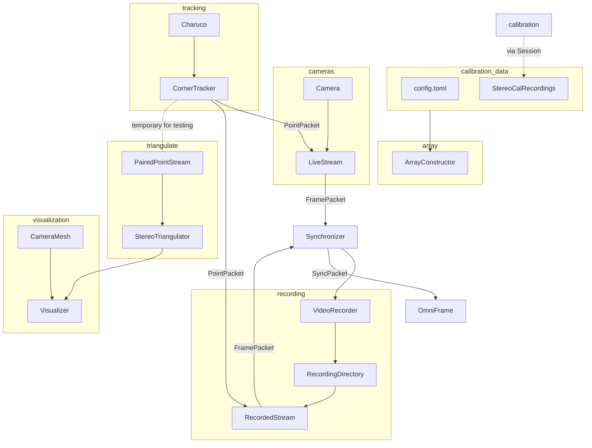

## Current Flow

The general flow of processing is illustrated in the graph below. 

Incremental improvements in the flow of the information processing are reflected below. The primary change for this branch is that they synchronizer will push a SyncPacket to the StereoTracker. The StereoTracker will then use the SyncPacket create a PairedPointsPacket. This will provide the primary input for the OmniFrame. One aspect of this that I have not sorted out is where the history of points used by the OmniFrame for feedback to the user will be stored.

