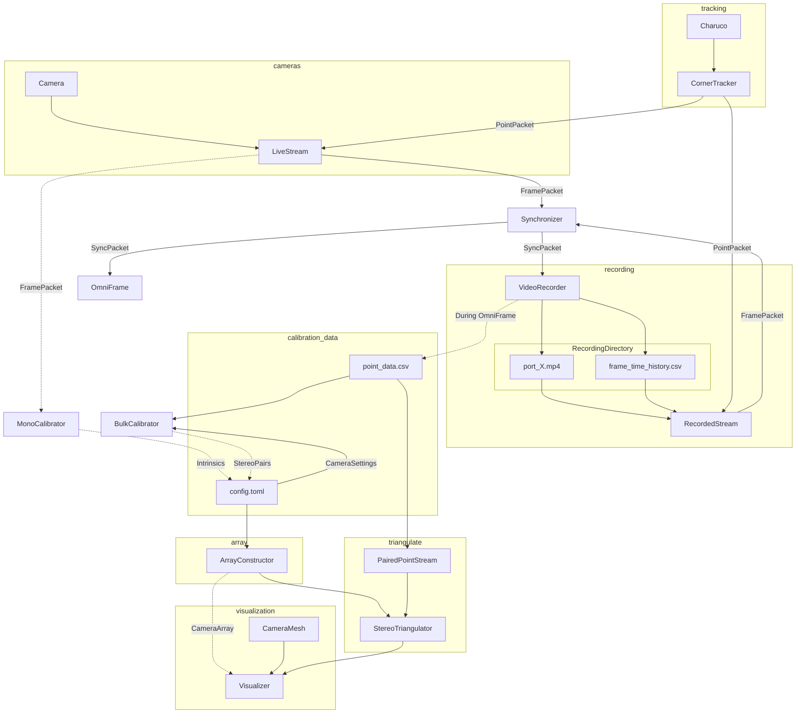

## Current Flow

The general flow of processing is illustrated in the graph below. 

The `Synchronizer` is now producing `SyncPackets` from the set of  `LiveStream` objects provided to it. The previous code for recording video will no longer work, so must be updated. Additionally, when recording video the `VideoRecorder` should save out any point data that is calculated during the recording session so that it can be processed downstream.

The general plan for a revision to the current process is shown here.

Note that the sections of code that do not have a link in some way to the synchronizer are not currently functional.

