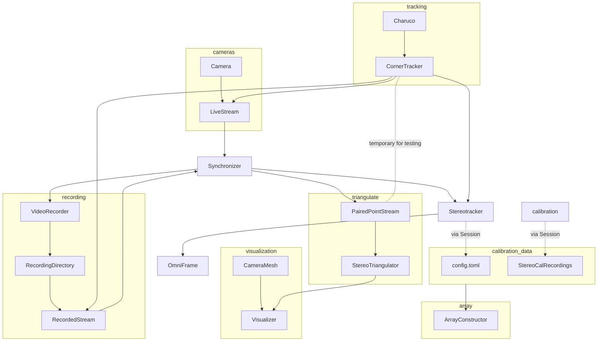

## Current Flow

The general flow of processing is illustrated in the graph below. 

Not illustrated is the omniframe which is the primary GUI element providing feedback to the user regarding position of the charuco board to provide the best input data to the calibrator.

A future organizational improvement may be to perform corner tracking *prior to* synchronization. This will avoid the frequent reuse of the tracker in some ad-hoc data processing. Just save the corner data during the initial streaming of video data, Mac. Don't keep going back to the well.

Another potential advantage of this it may facilitate a future refactor where the camera/stream/tracking stack is pushed into its own process which may take some load off of the primary process. Frame, time, and corner data can be passed back into the synchronizer for a single-point-of-contact for the rest of the program.

I think I might be returning to the original design I had of including the point tracker *within* the running stream thread. This set itself up nicely for real time point tracking as the frame-rate would self-throttle based on the processing demands of the point tracker...

