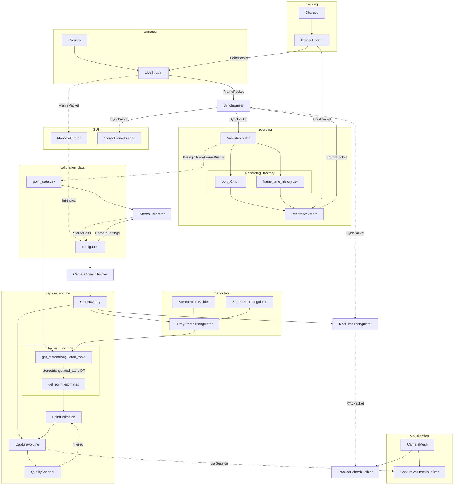

## Current Flow

The general flow of processing is illustrated in the graph below. This is not intended to be useful to anyone other than those involved in programming of core processes. If that is not you, then feel free to ignore.

