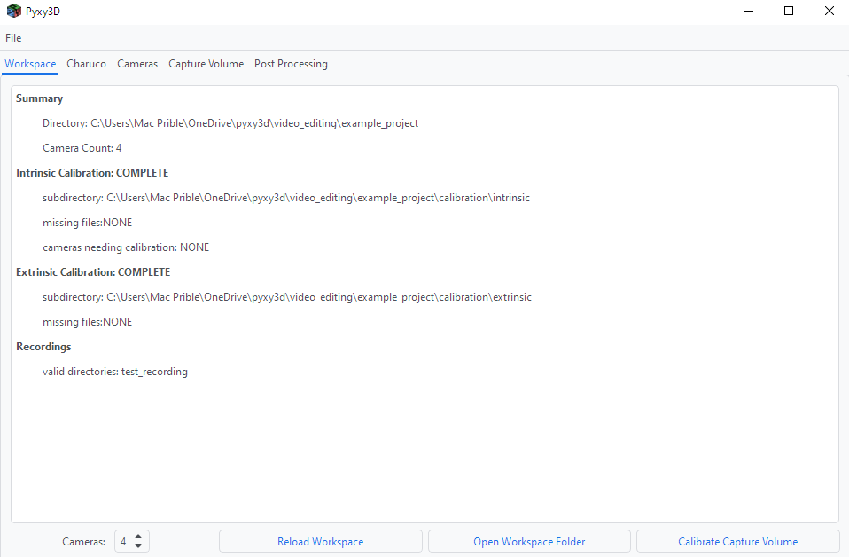

*The workspace tab after intrinsic and extrinsic calibration is complete and the videos in `project_root/recordings/test_recording/` are ready to be processed.*

---

Step one of any project is to set the number of cameras you intend to integrate. With this number set, click `Reload Workspace` to get an updated summary of any missing files or uncalibrated cameras.

As input video files are added and cameras are calibrated, you may need to click `Reload Workspace` for them to be recognized, or for other tabs (i.e. `Cameras`, `Capture Volume` and `Post Processing`) to become available.
